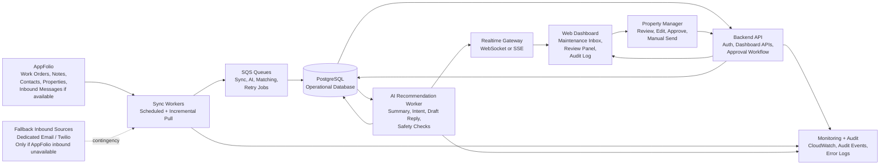
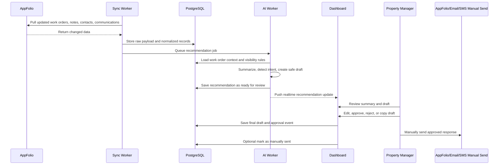
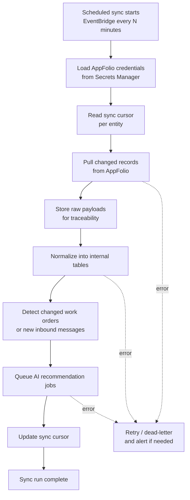
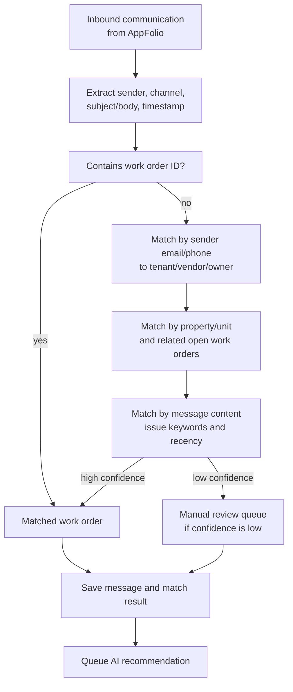
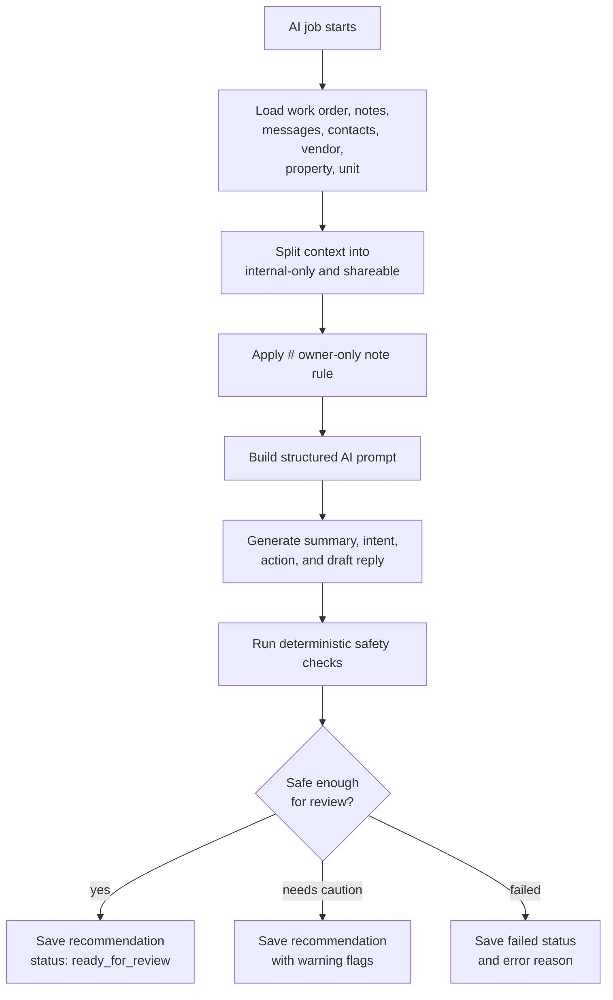
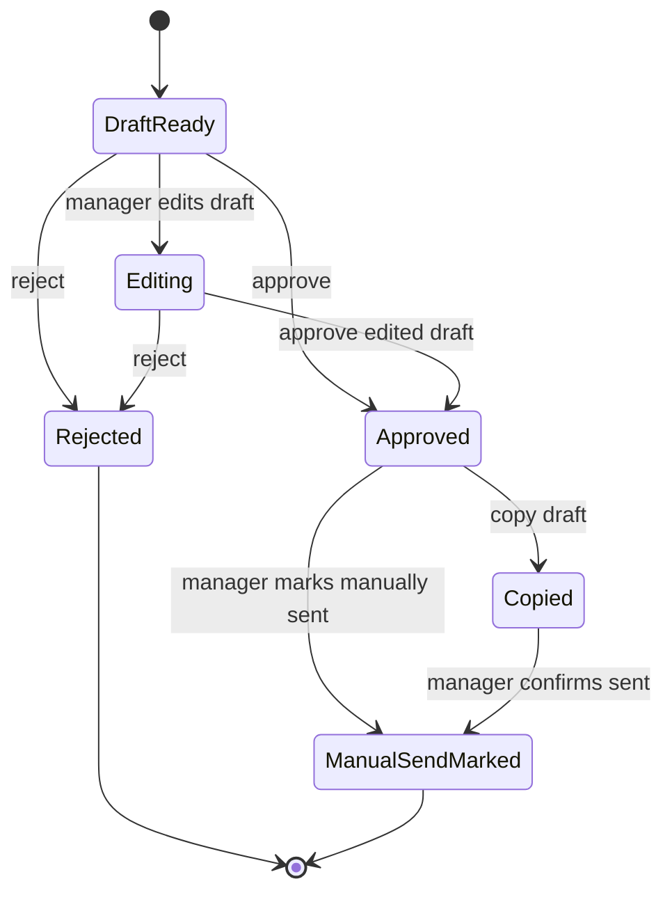
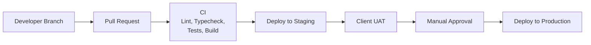

# AppFolio Maintenance AI Assistant - Phase 1 MVP End-to-End Plan

## 1. Executive Summary

The Phase 1 MVP is an internal AI-assisted maintenance inbox for property managers and maintenance staff.

The system syncs AppFolio maintenance context, including work orders, notes, tenants, vendors, properties, units, and inbound maintenance communication if available through the client's AppFolio access. The AI summarizes the current maintenance situation, detects message intent, recommends a safe reply, and highlights follow-up actions.

In Phase 1, the AI does not send messages automatically. A human property manager reviews, edits, approves, rejects, and manually sends the final response through AppFolio, email, SMS, or the team's existing workflow.

### Phase 1 Goal

Help property managers quickly understand maintenance context and approve AI-recommended replies while keeping humans in control of outbound communication.

### Phase 1 Core Promise

- Pull maintenance data from AppFolio.
- Show live maintenance cases in a dashboard.
- Summarize work order context.
- Detect tenant/vendor/owner intent.
- Recommend safe replies and vendor follow-ups.
- Protect internal/owner-only notes marked with `#`.
- Require human review before any response is used.
- Track AI suggestions, edits, approvals, rejections, and timestamps.

### Phase 1 Messaging Boundary

- Inbound messages are expected to come from AppFolio if available.
- Dedicated email/Twilio inbound webhooks are fallback options only if AppFolio does not expose inbound communications.
- Outbound sending is manual in Phase 1.
- The system can provide copy-ready approved drafts, but does not send emails or SMS itself.

---

## 2. High-Level Architecture



### Architecture Style

Use a modular service architecture:

- **Next.js web dashboard** for property managers.
- **Backend API service** for data access, approval workflow, auth, and realtime events.
- **Worker service** for AppFolio sync, message matching, AI recommendation generation, retries, and stale work order checks.
- **PostgreSQL database** as the source of truth for normalized operational data.
- **SQS queues** for asynchronous jobs and reliable retries.
- **AWS managed infrastructure** for production deployment.

---

## 3. MVP Scope

### Required

| Module | Phase 1 Behavior |
| --- | --- |
| AppFolio Maintenance Sync | Sync work orders and maintenance-related data from AppFolio. |
| Work Order Notes | Read notes if available through AppFolio access. |
| Inbound Communication | Prefer AppFolio-synced inbound email/SMS/communication records if available. |
| Message Matching | Match inbound messages to work orders where possible. |
| AI Summary | Summarize work order, notes, messages, tenant/vendor/property/unit context. |
| AI Intent Detection | Detect what the tenant, vendor, or owner is asking. |
| AI Reply Draft | Generate a recommended response draft. |
| Vendor Reminder Recommendation | Suggest follow-ups when vendor action is stale or missing. |
| Human Approval | Property manager reviews, edits, approves, rejects, or copies the draft. |
| Owner-only Notes Rule | Notes marked with `#` are internal and excluded from tenant/vendor replies. |
| Audit Log | Track AI draft, final edited draft, approval/rejection, user, and timestamp. |
| Dashboard | Show work orders, latest context, summary, recommendation, and review actions. |
| User Roles & Permissions | Separate internal, owner, vendor, and tenant visibility. |
| Monitoring | Track sync failures, AI failures, webhook failures, and queue failures. |
| Deployment | Deploy frontend, backend, database, workers, queues, secrets, logs, and monitoring. |

### Conditional

| Module | Phase 1 Behavior |
| --- | --- |
| AppFolio Inbound Messages | Required if available. If unavailable, use fallback dedicated email/Twilio inbound. |
| Attachments / Photos | Store references if AppFolio exposes them. Defer AI image analysis. |
| AppFolio Write-back | Defer by default. Only add after AppFolio entitlement and safe write support are confirmed. |

### Out of Scope for Phase 1

- Tenant-facing chatbot.
- Fully automated outbound email/SMS.
- AI sending messages without manager approval.
- Payment automation.
- Vendor dispatch automation.
- Legal decisioning.
- Owner financial reporting beyond maintenance context.
- Full AppFolio write-back unless explicitly confirmed safe.

---

## 4. User Roles

| Role | Phase 1 Access |
| --- | --- |
| Admin | Full system access, configuration, integrations, audit log. |
| Property Manager | Work order inbox, AI summaries, recommendations, approvals, copy-ready drafts. |
| Maintenance Staff | Work order context, vendor follow-up status, internal notes as permitted. |
| Owner | Not a primary dashboard user in Phase 1 unless explicitly enabled. |
| Vendor | Not a dashboard user in Phase 1. Vendor context is used for recommendations only. |
| Tenant | Not a dashboard user in Phase 1. Tenant messages/context are used for recommendations only. |

---

## 5. Core Workflow



---

## 6. Detailed Data Flows

### 6.1 AppFolio Sync Flow



### 6.2 Inbound Message Matching Flow



### 6.3 AI Recommendation Flow



### 6.4 Human Approval Flow



---

## 7. Data Model

### 7.1 Core Tables

| Table | Purpose |
| --- | --- |
| `organizations` | Client/property management company account. |
| `users` | Internal app users and roles. |
| `properties` | AppFolio properties/buildings. |
| `units` | Units linked to properties. |
| `tenants` | Tenant contact/context data. |
| `owners` | Owner contact/context data. |
| `vendors` | Vendor contact/service data. |
| `work_orders` | Maintenance work orders from AppFolio. |
| `work_order_notes` | Notes from AppFolio, with internal/owner-only classification. |
| `work_order_attachments` | Attachment/photo references if available. |
| `messages` | Inbound communications synced from AppFolio or fallback sources. |
| `message_matches` | Link between messages and work orders with confidence. |
| `ai_recommendations` | AI summary, intent, action, draft, safety flags, status. |
| `approval_events` | Review, edit, approve, reject, copy, manual-send mark events. |
| `sync_runs` | Sync status, cursors, counts, errors, duration. |
| `integration_payloads` | Raw AppFolio/fallback payload storage for debugging. |
| `audit_events` | Immutable user/system actions for accountability. |

### 7.2 Work Order Fields

Minimum internal fields:

```ts
type WorkOrder = {
  id: string;
  appfolioId: string;
  propertyId: string;
  unitId?: string;
  tenantId?: string;
  vendorId?: string;
  title: string;
  description: string;
  category?: string;
  priority?: "low" | "medium" | "high" | "urgent";
  status: "open" | "in_progress" | "waiting_vendor" | "waiting_tenant" | "resolved" | "closed";
  reportedAt?: string;
  scheduledAt?: string;
  completedAt?: string;
  lastAppfolioUpdatedAt: string;
  createdAt: string;
  updatedAt: string;
};
```

### 7.3 AI Recommendation Fields

```ts
type AiRecommendation = {
  id: string;
  workOrderId: string;
  sourceMessageId?: string;
  status:
    | "queued"
    | "processing"
    | "ready_for_review"
    | "approved"
    | "rejected"
    | "copied"
    | "manual_send_marked"
    | "failed";
  summary: string;
  detectedIntent:
    | "asking_eta"
    | "reporting_new_issue"
    | "requesting_update"
    | "confirming_schedule"
    | "cost_approval"
    | "vendor_follow_up"
    | "urgency_escalation"
    | "general_update";
  recommendedAction: string;
  audience: "tenant" | "vendor" | "owner" | "internal";
  draftReply: string;
  finalEditedReply?: string;
  excludedInternalContext: boolean;
  safetyFlags: string[];
  confidence: "low" | "medium" | "high";
  createdAt: string;
  updatedAt: string;
};
```

---

## 8. API Surface

### Dashboard APIs

| Method | Endpoint | Purpose |
| --- | --- | --- |
| `GET` | `/api/work-orders` | List inbox work orders with filters. |
| `GET` | `/api/work-orders/:id` | Get full work order detail. |
| `GET` | `/api/work-orders/:id/timeline` | Get notes, messages, status changes, AI events. |
| `GET` | `/api/recommendations` | List recommendations by status. |
| `GET` | `/api/recommendations/:id` | Get recommendation detail. |
| `POST` | `/api/recommendations/:id/refresh` | Regenerate AI recommendation. |
| `POST` | `/api/recommendations/:id/approve` | Approve original or edited draft. |
| `POST` | `/api/recommendations/:id/reject` | Reject recommendation. |
| `POST` | `/api/recommendations/:id/copy` | Track that approved draft was copied. |
| `POST` | `/api/recommendations/:id/mark-manual-sent` | Track that manager manually sent response. |
| `GET` | `/api/audit-events` | Query audit log. |
| `GET` | `/api/sync-runs` | View integration sync health. |

### Worker/Internal APIs

| Method | Endpoint | Purpose |
| --- | --- | --- |
| `POST` | `/internal/jobs/appfolio-sync` | Trigger AppFolio sync job. |
| `POST` | `/internal/jobs/message-match` | Match inbound message to work order. |
| `POST` | `/internal/jobs/generate-recommendation` | Generate AI recommendation. |
| `POST` | `/internal/jobs/stale-vendor-check` | Create vendor reminder recommendations. |

### Fallback Inbound Webhooks

Only enable these if AppFolio does not expose inbound communication records.

| Method | Endpoint | Purpose |
| --- | --- | --- |
| `POST` | `/webhooks/email/inbound` | Receive dedicated maintenance email inbound. |
| `POST` | `/webhooks/twilio/sms` | Receive inbound SMS from Twilio. |

---

## 9. Dashboard Plan

### 9.1 Main Navigation

- Maintenance Inbox
- Work Order Detail
- Recommendation Review
- Manual Send Tracking
- Audit Log
- Sync Health
- Settings

### 9.2 Maintenance Inbox

Show:

- Work order ID
- Property/unit
- Tenant/vendor
- Priority
- Current status
- Latest inbound message
- AI recommendation status
- Stale/vendor follow-up indicator
- Last updated time

Filters:

- Ready for review
- Needs manual matching
- Urgent
- Waiting vendor
- Waiting tenant
- Stale
- Failed AI
- Recently approved

### 9.3 Work Order Detail

Show:

- AppFolio work order context
- Tenant, vendor, property, unit context
- Notes timeline
- Inbound communication timeline
- Attachments/photos if available
- Internal/owner-only note indicators
- AI summary
- AI-detected intent
- Recommended action
- Draft reply
- Safety flags
- Approval history

### 9.4 Review Panel

Actions:

- Edit draft
- Approve draft
- Reject draft
- Regenerate recommendation
- Copy approved reply
- Mark manually sent

The primary CTA after approval should be:

- `Copy Approved Draft`

The system should not show a `Send` CTA in Phase 1.

---

## 10. AI Safety Rules

### Required Deterministic Rules

- Never send automatically.
- Never include notes marked with `#` in tenant/vendor replies.
- Never expose owner-only/private internal context to tenant/vendor audiences.
- Never invent vendor ETA, cost approval, completion status, or appointment confirmation.
- Never make legal, insurance, or liability claims.
- Flag urgent issues such as flooding, fire, electrical danger, gas leak, or lockout.
- Use source-grounded language: "Based on the current work order notes..." instead of unsupported certainty.

### Recommended AI Response Pattern

Each AI output should include:

- Short maintenance summary.
- Detected intent.
- Recommended next action.
- Draft reply.
- Safety flags.
- Confidence level.
- Source context used.
- Source context excluded.

---

## 11. Infrastructure Plan

### 11.1 AWS Components

| Component | Service |
| --- | --- |
| Frontend | AWS App Runner or ECS Fargate |
| Backend API | ECS Fargate |
| Worker Service | ECS Fargate |
| Database | Amazon RDS PostgreSQL |
| Queues | Amazon SQS + dead-letter queues |
| Scheduler | Amazon EventBridge |
| File Storage | Amazon S3 |
| Secrets | AWS Secrets Manager |
| Logs | Amazon CloudWatch Logs |
| Metrics/Alarms | CloudWatch Metrics + Alarms |
| DNS/TLS | Route 53 + ACM |
| Optional Edge Protection | AWS WAF |

### 11.2 Environment Layout

| Environment | Purpose |
| --- | --- |
| Local | Developer testing with seeded mock data. |
| Staging/UAT | Client testing with AppFolio sandbox or limited real data. |
| Production | Live client environment. |

### 11.3 Deployment Flow



### 11.4 Secrets

Store in AWS Secrets Manager:

- AppFolio credentials/API keys.
- Database connection string.
- AI provider API key.
- Email fallback provider keys if used.
- Twilio fallback credentials if used.
- JWT/session secrets.
- Webhook signing secrets.

---

## 12. Monitoring And Operations

### Required Monitoring

- AppFolio sync success/failure.
- Sync duration and records processed.
- API error rate.
- Worker job failures.
- Queue depth.
- Dead-letter queue count.
- AI generation failures.
- Recommendation latency.
- Manual review backlog.
- Webhook failures if fallback inbound is used.
- Database CPU/storage/connections.

### Alerts

Create alerts for:

- AppFolio sync failing repeatedly.
- AI recommendation jobs failing repeatedly.
- Dead-letter queue not empty.
- API 5xx rate above threshold.
- Queue backlog growing for more than a defined period.
- Database storage nearing limit.

### Runbooks

Create short runbooks for:

- AppFolio sync failure.
- AI provider outage.
- Stuck recommendation queue.
- Failed message matching.
- Incorrect AI recommendation report.
- Database restore.
- Secret rotation.

---

## 13. Implementation Phases

### Phase 0 - Discovery And Access Validation

Goals:

- Confirm AppFolio API/MAX/database access.
- Confirm available maintenance work order fields.
- Confirm notes access.
- Confirm inbound communication availability.
- Confirm attachment/photo access.
- Confirm rate limits and authentication method.
- Confirm whether write-back is possible, but keep it out of default Phase 1.

Deliverables:

- AppFolio integration discovery report.
- Confirmed entity mapping.
- Confirmed sync strategy.
- Finalized fallback inbound decision.

### Phase 1A - Backend Foundation

Build:

- PostgreSQL schema.
- Auth and role model.
- Backend API skeleton.
- Worker service skeleton.
- SQS queues and job contracts.
- Audit event foundation.
- Local seed data.

### Phase 1B - AppFolio Sync

Build:

- AppFolio connector.
- Sync cursors.
- Raw payload storage.
- Normalization into internal tables.
- Work order sync.
- Notes sync.
- Tenant/vendor/property/unit sync.
- Inbound communication sync if available.
- Sync health dashboard.

### Phase 1C - AI Recommendation Pipeline

Build:

- Context builder.
- Internal/shareable context splitter.
- `#` owner-only note exclusion.
- AI prompt and structured output parser.
- Safety checker.
- Recommendation storage.
- Retry and failure handling.

### Phase 1D - Dashboard MVP

Build:

- Maintenance inbox.
- Work order detail page.
- AI summary and recommendation panel.
- Review/edit/approve/reject workflow.
- Copy approved draft.
- Mark manually sent.
- Audit log view.
- Realtime dashboard updates.

### Phase 1E - UAT And Production Hardening

Build:

- Staging deployment.
- Production deployment.
- Monitoring and alerts.
- Runbooks.
- Client UAT fixes.
- Security review.
- Backup and restore test.

---

## 14. Testing Plan

### Unit Tests

- AppFolio payload normalization.
- Message matching scoring.
- `#` note classification.
- Context visibility filtering.
- AI output validation.
- Recommendation status transitions.
- Permission checks.

### Integration Tests

- AppFolio sync creates work orders.
- AppFolio sync updates existing work orders.
- Notes sync attaches notes to the correct work order.
- Inbound communication matches the correct work order.
- Low-confidence messages enter manual review.
- AI job creates a recommendation.
- Approval creates audit events.
- Copy/manual-send tracking updates recommendation status.

### End-to-End Tests

Scenarios:

1. New work order syncs from AppFolio.
2. AI summary and recommendation appear in dashboard.
3. Manager edits and approves the draft.
4. Manager copies the approved draft.
5. Manager marks the response as manually sent.
6. Audit log shows original AI draft, edited final draft, approver, and timestamp.

Safety scenarios:

1. Work order has a note marked with `#`.
2. AI summary can mention internal context to manager.
3. Tenant/vendor draft does not include `#` note content.
4. Safety flag confirms internal context was excluded.

Failure scenarios:

1. AppFolio sync fails and retries.
2. AI provider fails and recommendation status becomes failed.
3. Message cannot be matched and goes to manual review.
4. Queue job fails and lands in dead-letter queue.

---

## 15. Acceptance Criteria

Phase 1 is complete when:

- AppFolio work orders and maintenance context sync into the system.
- AppFolio inbound communications sync if available through the client's access.
- Fallback inbound path is documented or implemented only if AppFolio inbound is unavailable.
- Property managers can view a maintenance inbox.
- Property managers can open a work order and see synced context.
- AI generates a summary, intent, recommended action, and draft reply.
- Draft replies exclude `#` owner-only/internal notes.
- Property managers can edit, approve, reject, copy, and mark manually sent.
- No automated outbound email/SMS exists in Phase 1.
- Audit log records AI draft, edited draft, approval/rejection, user, and timestamp.
- Sync, AI, queue, and API failures are monitored.
- Staging and production deployments are complete.

---

## 16. Key Assumptions

- AppFolio API/MAX/database access is available.
- AppFolio is the preferred source for inbound maintenance communication.
- If AppFolio does not expose inbound email/SMS records, dedicated email/Twilio inbound becomes the fallback.
- Outbound email/SMS is manual in Phase 1.
- OpenAI or an equivalent AI provider will be used behind a service abstraction.
- AWS managed infrastructure is the preferred deployment target.
- Existing Next.js demo code can be used as UI inspiration, but production requires backend, database, workers, integrations, and auth.

---

## 17. Recommended First Sprint

### Sprint Goal

Validate AppFolio access and build the foundation needed to sync and display real maintenance data.

### Sprint Tasks

- Confirm AppFolio credentials, access method, and available endpoints/tables.
- Create database schema for work orders, notes, contacts, messages, recommendations, and audit events.
- Build AppFolio connector skeleton.
- Implement work order sync.
- Implement notes sync if available.
- Build basic maintenance inbox page.
- Build work order detail page with synced context.
- Add sync run logging.

### Sprint Demo

Show a property manager:

1. AppFolio work orders synced into the dashboard.
2. A work order detail page with notes and property/unit/vendor/tenant context.
3. Sync health and last successful sync time.

